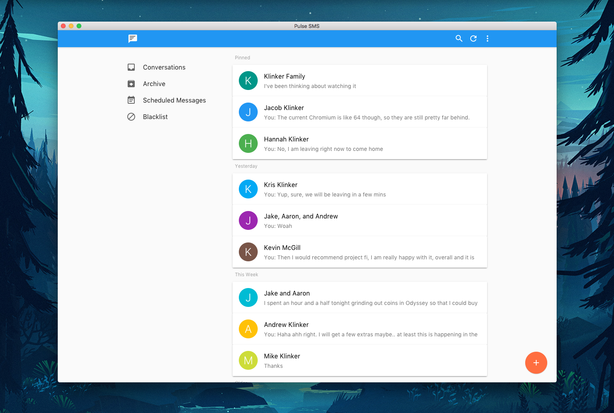

# Pulse SMS - Desktop



An Electron app that wraps the Pulse web app. With this desktop implementation, you get:

* Native notifications through persistent web socket
* Notification customizations
* Notification snooze support
* Spell check
* Always active window
* Tray/Menu Bar support
* Unread badge support for Mac and Linux
* Hidden menu bar option for Windows and Linux

The desktop app is built on top of Electron's `BrowserView`, rather than Chromium's `webview`.

## Build Instructions

You will need to set up Node.js. Pulse uses a typical Node development environment.

1. Use Yarn as the package manager (this is a recommendation from the `electron-builder` tool):

```
$ npm install yarn -g
```

2. Install the dependencies:

```
$ yarn
```

3. Run the app:

```
$ yarn start
```

The app will only run if you have shut down any other instances. To ensure that only one web socket connection is made and managed, only a single instance of Pulse is allowed to run. That means that if you have the production version of the Pulse desktop app running, you won't be able to run a development version at the same time. If you use `yarn start` while that production instance is running, it will simply display the window of that production instance, instead of starting a new instance of the app.

## Packaging Information

To package the apps for each platform:

```
// MacOS (dmg)
$ yarn build-mac

// Windows (installer with 32 and 64 bit support)
$ yarn build-windows

// Linux (deb and AppImage)
$ yarn build-linux
```

To create production releases of the apps, follow these instructions: https://github.com/klinker-apps/pulse-sms-desktop/blob/master/DIST_BUILD_NOTES.md

## Contributing

Please fork this repository and contribute back using [pull requests](https://github.com/klinker-apps/pulse-desktop/pulls). Features can be requested using issues on our Pulse platform issue tracker, rather than creating issues directly on this repo: https://github.com/klinker-apps/messenger-issues.

This project was originally a JavaScript project and I am not a big fan of JavaScript. As such, the project now uses Typescript. Many things aren't structured in a very Typescript-y way. I will continue to improve this, as I have time. Pull requests would be more than welcome, to make the app more Typescript-y.

## License

    Copyright 2019 Luke Klinker

    Licensed under the Apache License, Version 2.0 (the "License");
    you may not use this file except in compliance with the License.
    You may obtain a copy of the License at

       http://www.apache.org/licenses/LICENSE-2.0

    Unless required by applicable law or agreed to in writing, software
    distributed under the License is distributed on an "AS IS" BASIS,
    WITHOUT WARRANTIES OR CONDITIONS OF ANY KIND, either express or implied.
    See the License for the specific language governing permissions and
    limitations under the License.
